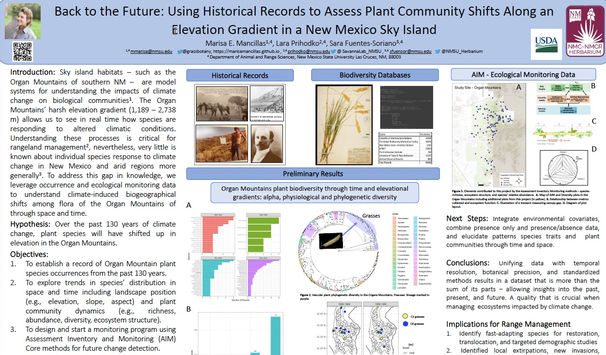

As a graduate student and research assistant with the Dr. Fuentes-Soriano [Herbarium Lab](https://aces.nmsu.edu/herbarium/index.html), I've had the opportunity to work on a variety of projects. My research project is about understanding if and how plant species are shifting their distributions in association with changing climatic conditions over time in the Organ Mountains of South-Central New Mexico. For this project, I have harmonized, cleaned and restructured biodiversity occurence data accross multiple databses using R programing language. Additionally, I've  as well as collecting plant specimens and collecte ecological monitoring data. 

Here is a poster describing the project:

	
