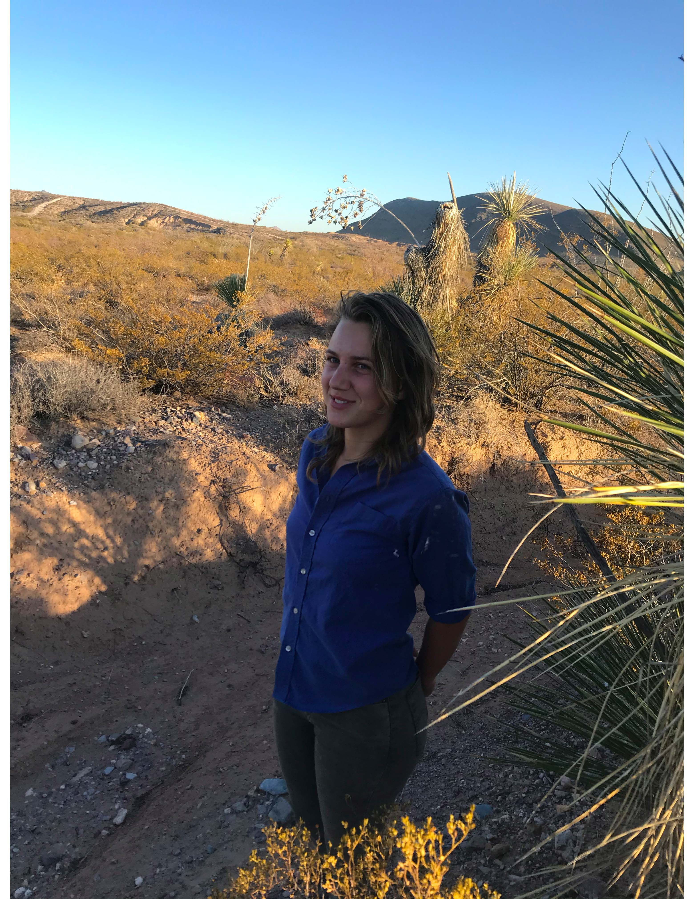

I am a first year MS student in Fish, Wildlife and Conservation Ecology at New Mexico State University. I will be working on a Burrowing Owl translocation project around Phoenix, Arizona. 

I have previously worked with small owls, diurnal raptors, waterbirds and songbirds. I also have experience performing a variety of statistical analyses on various longitudinal data sets, as well as extensive experience working with GIS.

