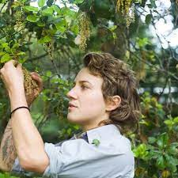

Hi, my name is Marisa! I am a field botanist interested in the ecology of rangelands and prairie ecosystems. I have worked in 10 Western U.S. States on wetland mitigation, reclamation, and restoration sites as a field manager, crew leader, and technician. I have also worked on rangeland inventories and invasive species surveys, and endangered plant species monitoring projects. 

Currently, I am in a rangeland ecology masters program at New Mexico State University, studying biogeographic shifts among plant communities in association with climate change and elevation gradients. I received my B.S. in ecological restoration and biology from the University of Montana in 2016. 
 
Interests: rangeland ecology, botany, ecology, restoration, historical ecology, ethnobotany, gardening, leadership, and mentoring. 

