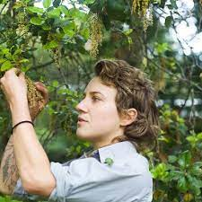

I am a field botanist interested in the ecology of rangelands and prairie ecosystems. I have worked in 10 Western US States on wetland mitigation, reclamation, and restoration sites as a field manager, crew leader, and technician.  

Currently, I am in a rangeland ecology masters program at New Mexico State University, studying biogeographic shifts among plant communities in association with climate change and elevation gradients. 
 
Interests: rangeland ecology, botany, ecology, restoration, historical ecology, ethnobotany, gardening, leadership, and mentoring. 

